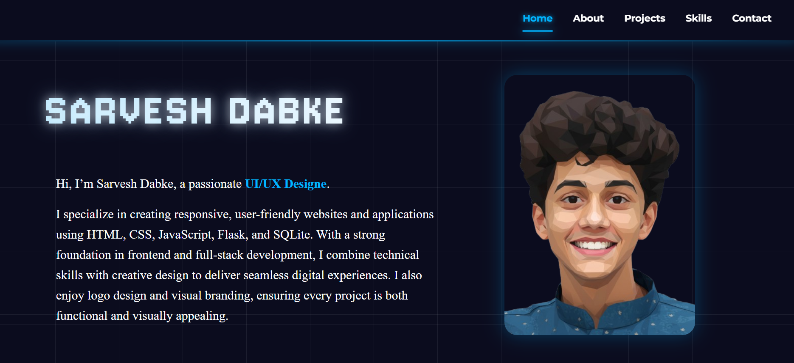
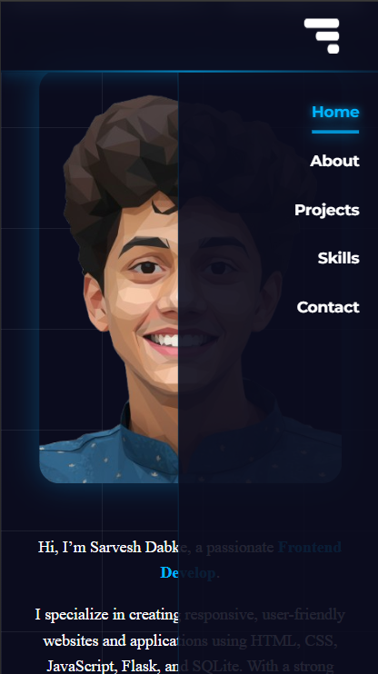
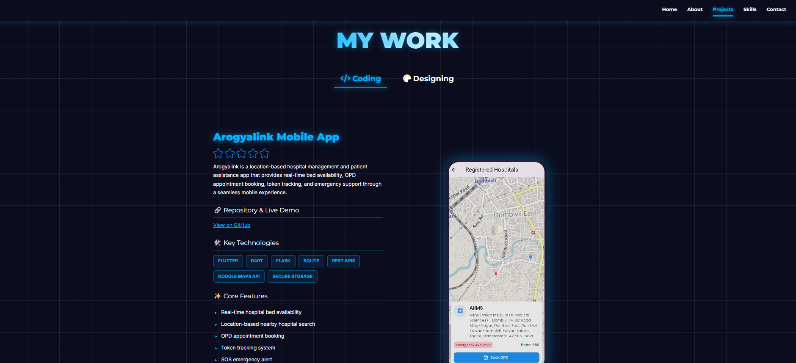
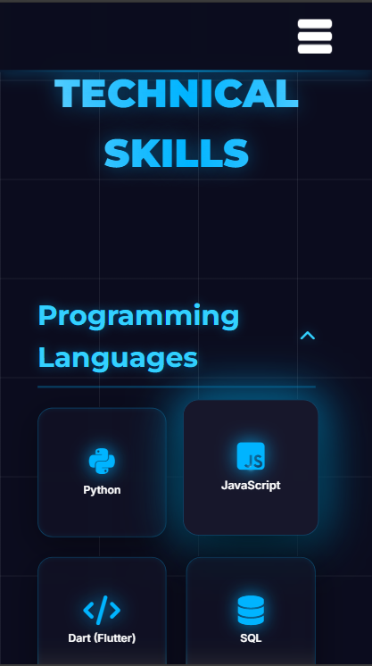

<!-- ------------------ Banner ------------------ -->

  

<h1 align="center">👨‍💻 Sarvesh Dabke - Personal Portfolio</h1>

  <!-- Badges -->
  
  
  
  
  
  

---

## 📖 About The Project

This is a fully responsive personal portfolio website designed to showcase my skills, projects, and experience as a Web Developer and UI/UX Designer.

It features a decoupled architecture where the **Frontend** is hosted on Vercel and the **Backend** (handling emails and custom analytics) is hosted on Render/Railway.

---

## 🏗️ **Project Architecture**
Frontend (Vercel) → API Requests → Backend (Flask - Render)
→ Analytics Logging (SQLite)

---

## 🌟 Key Features

### 🎨 Immersive UI/UX
- Animated "Typewriter" splash screen (`index.html`)
- Glassmorphism effects and neon glow accents
- Fully responsive layout (Mobile, Tablet, Desktop)

### 📱 Adaptive Mobile Design
- Custom Hamburger Menu with Glass Drawer effect (Right-aligned)
- Accordion-style "Skills" section for mobile
- Optimized spacing + alignment

### 🛠️ Dynamic Project Showcase
- Tabs for Coding and Designing projects  
- Image sliders + Video previews

### 📧 Functional Contact Form
- Connected to Flask backend  
- Sends emails using Gmail SMTP  

### 📊 Custom Analytics Tracker
- Tracks IP, Browser, OS, Device Type  
- Detects returning users  
- Saves logs in SQLite  

---

## 📸 Screenshots

**Desktop View**  

**Mobile Menu**  

**Project Section**  

**Skills Accordion (Mobile)**  

---

## 🔗 Live Website  
👉 **https://sarvesh-dabke-portfolio.vercel.app**

---

## 🛠️ Tech Stack

**Frontend:** HTML5, CSS3, JavaScript  
**Backend:** Python, Flask, SQLite, SMTP  

---

## 🚀 Local Installation & Setup

### 1. Clone the Repository

git clone https://github.com/sarveshdabke/My-Portfolio.git
cd My-Portfolio

### 2. Run Backend

cd backend
python app.py

### 3. Open Frontend

Simply open index.html in a browser.

---

⭐ Show Your Support

If you like this project, consider giving it a ⭐ star on GitHub!
It motivates me to build more amazing projects.